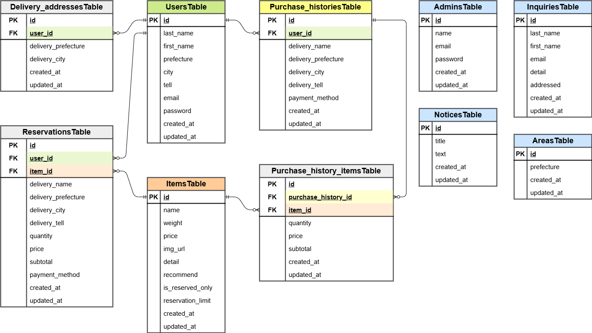
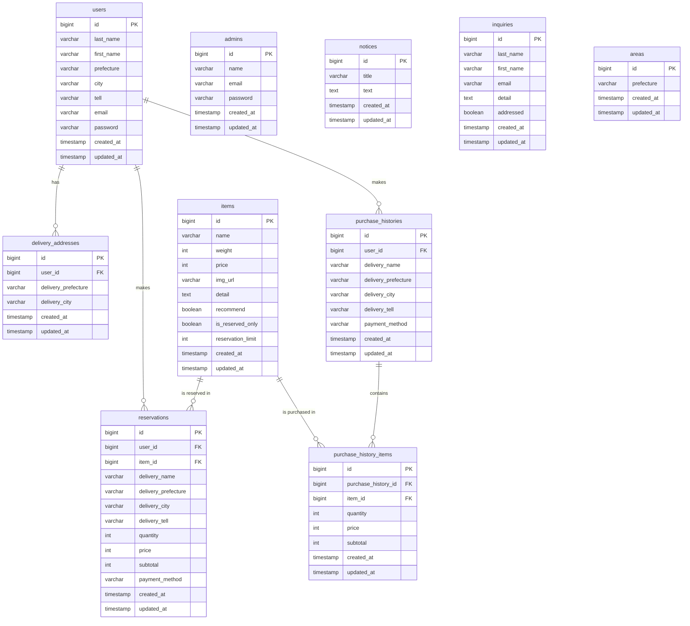

# ER図

## Mermaid版

上の画像と同じ内容をテキストで表したものです。カラムの詳細は [テーブル仕様書](05-table-specification.md) を参照してください。

```mermaid
erDiagram
    users ||--o{ delivery_addresses : "has"
    users ||--o{ reservations : "makes"
    users ||--o{ purchase_histories : "makes"
    items ||--o{ reservations : "is reserved in"
    items ||--o{ purchase_history_items : "is purchased in"
    purchase_histories ||--o{ purchase_history_items : "contains"

    users {
        bigint id PK
        varchar last_name
        varchar first_name
        varchar prefecture
        varchar city
        varchar tell
        varchar email
        varchar password
        timestamp created_at
        timestamp updated_at
    }

    delivery_addresses {
        bigint id PK
        bigint user_id FK
        varchar delivery_prefecture
        varchar delivery_city
        timestamp created_at
        timestamp updated_at
    }

    reservations {
        bigint id PK
        bigint user_id FK
        bigint item_id FK
        varchar delivery_name
        varchar delivery_prefecture
        varchar delivery_city
        varchar delivery_tell
        int quantity
        int price
        int subtotal
        varchar payment_method
        timestamp created_at
        timestamp updated_at
    }

    purchase_histories {
        bigint id PK
        bigint user_id FK
        varchar delivery_name
        varchar delivery_prefecture
        varchar delivery_city
        varchar delivery_tell
        varchar payment_method
        timestamp created_at
        timestamp updated_at
    }

    purchase_history_items {
        bigint id PK
        bigint purchase_history_id FK
        bigint item_id FK
        int quantity
        int price
        int subtotal
        timestamp created_at
        timestamp updated_at
    }

    items {
        bigint id PK
        varchar name
        int weight
        int price
        varchar img_url
        text detail
        boolean recommend
        boolean is_reserved_only
        int reservation_limit
        timestamp created_at
        timestamp updated_at
    }

    admins {
        bigint id PK
        varchar name
        varchar email
        varchar password
        timestamp created_at
        timestamp updated_at
    }

    notices {
        bigint id PK
        varchar title
        text text
        timestamp created_at
        timestamp updated_at
    }

    inquiries {
        bigint id PK
        varchar last_name
        varchar first_name
        varchar email
        text detail
        boolean addressed
        timestamp created_at
        timestamp updated_at
    }

    areas {
        bigint id PK
        varchar prefecture
        timestamp created_at
        timestamp updated_at
    }
```
